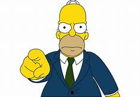

---
---
  
<link rel="stylesheet" href="styles.css" type="text/css">

# Óscar Alfredo Matute Mandujano

Soy Ingeniero Ambiental por la Universidad Católica de Honduras graduado en 2003. En 2009 conlcuí estudios de maestría en Planificación y Desarrollo Turístico.

En estos años he prestado servicios a instituciones gubernamentales, ONGD y empresas privadas nacionales y extranjeras, apoyando técnicamente actividades e iniciativas para la gestión ambiental y el desarrollo sostenible en las siguientes áreas: mejoramiento de barrios urbanos, desarrollo urbano, gestión de riesgos, ordenamiento territorial, caracterización territorial, convivencia y seguridad ciudadana, saneamiento básico, turismo y educación.
Además he participado directamente en más de treinta estudios de evaluación de impacto ambiental de proyectos de infraestructura a nivel nacional y he sido parte de equipos multidisciplinarios para elaborar estudios relacionados con seguridad ciudadana, turismo, ordenamiento territorial, gestión de riesgos y desarrollo humano.

Mi hoja de vida visual esta disponible [aquí](pdf/Chino.pdf).

# Klaus Wolfgang Wiese Acosta 

Disfruto el trabajo interdiciplinar que involucra la biología, la ingeniería, programación y demás ciencias. 

Soy Ingeniero Ambiental por la Universidad Católica de Honduras graduado en 2004. En 2009 concluí estudios de maestría en Tecnologías de Información Geográfica por la Universidad de Alcalá, Madrid, España. En 2015 comence estudios de doctorado en Ecología en la Universidad Polítécnica de Madrid, donde investigo sobre la estimación de la biodiversidad utilizando información de sensores remotos, buscando el desarrollo de un índice de complejidad de bosques. Espero terminar mis estudios a finales de 2019.

Trabajo en el Museo de Historia Natural desde el año 2011, donde comparto labores con los profesores Julio Mérida, Anthonie Andino y Gustavo Cruz. 

Mi hoja de vida visual esta disponible [aquí](pdf/CV.pdf).

